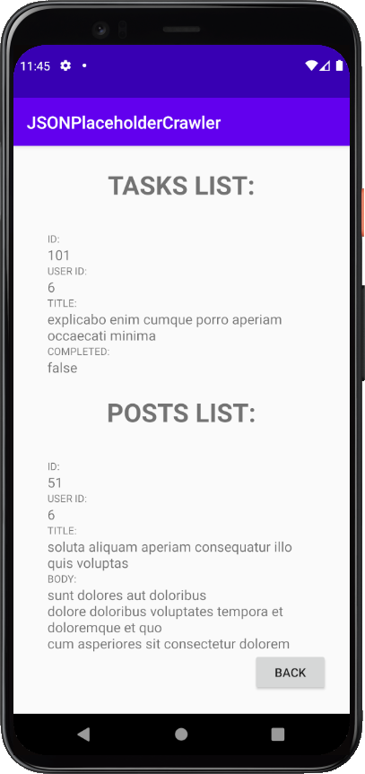

# JSONPlaceholderCrawler
This application fetches users, posts and comments from JSONPlaceholder API.

## Table of contents
* [General info](#general-info)
* [Technologies](#technologies)
* [Setup](#setup)
* [Screenshots](#examples)

## General info
This application uses URL class to collect data from API. 
JSON objects are presented using RecyclerViews.
The project was made in **April 2021**.

## Technologies
* Kotlin
* Klaxon (JSON parser)
* Android API 29
* Android Studio

## Setup
Clone this repository using git bash:
```
https://github.com/bartosztkowalski/JSONPlaceholderCrawler.git
```
It`s preferred to open in Android Studio. It shall be opened using **API 29** or newer.

## Screenshots


